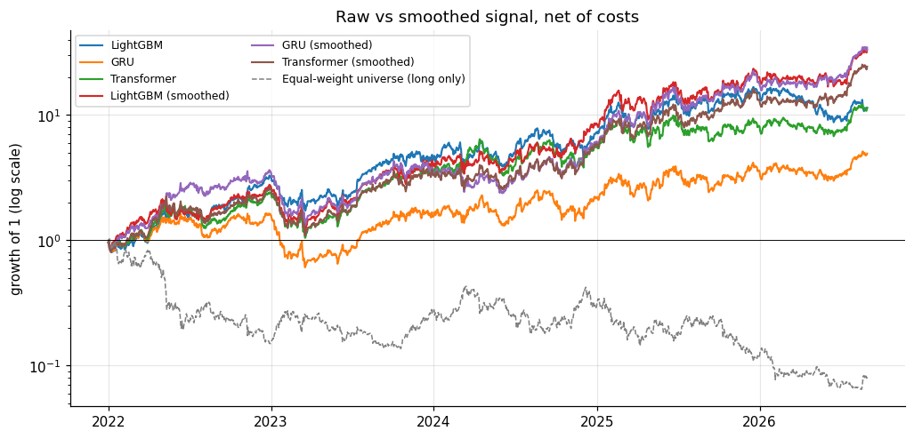
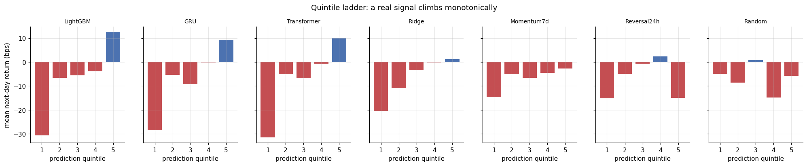
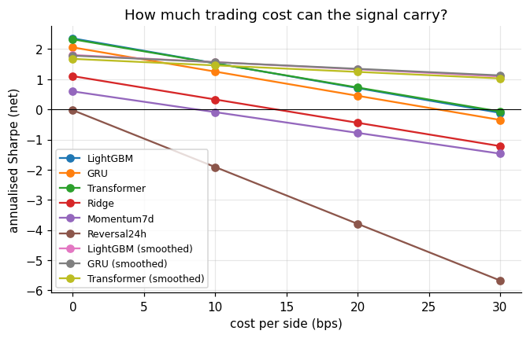
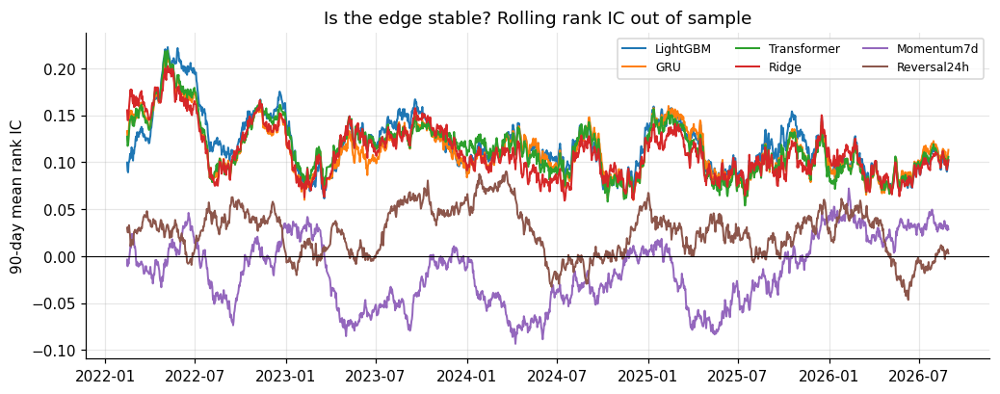
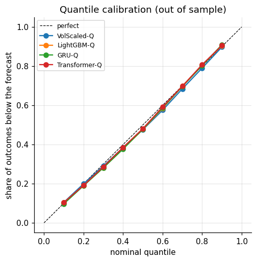

# Crypto Cross-Sectional Forecasting

**A signal that is real, and a Sharpe that is not proven.**
**Gerçek bir sinyal ve kanıtlanmamış bir Sharpe.**

Every day at 00:00 UTC I rank the ~30 most liquid coins on Binance by how I expect them to do over the next 24 hours *relative to each other*, trade the ranking as a long-short portfolio, and then try as hard as I can to prove the result is not real: point-in-time universe, walk-forward validation with an embargo, trading costs, a beta regression, null controls and a deflated Sharpe ratio for the number of strategies I tried.

Her gün 00:00 UTC'de Binance'teki en likit ~30 coini önümüzdeki 24 saatte *birbirlerine göre* nasıl performans göstereceklerini beklediğime göre sıralıyorum, bu sıralamayı long-short bir portföy olarak işliyorum ve sonra sonucun gerçek olmadığını kanıtlamak için elimden geleni yapıyorum: point-in-time evren, embargo'lu walk-forward doğrulama, işlem maliyetleri, beta regresyonu, sıfır kontrolleri ve denediğim strateji sayısı için deflated Sharpe oranı.



---

## Results / Sonuçlar

Out of sample, ten walk-forward folds stitched together: **January 2022 → August 2026**, 1,703 trading days, 15 bps cost per side.
Örneklem dışı, birbirine dikilmiş on walk-forward fold: **Ocak 2022 → Ağustos 2026**, 1.703 işlem günü, taraf başına 15 bps maliyet.

| Strategy | Rank IC | IC t (NW) | Sharpe gross | Sharpe net | Turnover / day | β to market | α bps/day (t) | PSR | Deflated Sharpe |
|---|---|---|---|---|---|---|---|---|---|
| **LightGBM (smoothed)** | 0.109 | 15.5 | 1.80 | **1.45** | 0.44 | −0.51 | 30.3 (4.3) | 0.999 | **0.12** |
| GRU (smoothed) | 0.108 | 15.4 | 1.78 | 1.46 | 0.41 | −0.54 | 30.0 (4.5) | 0.999 | 0.12 |
| Transformer (smoothed) | 0.107 | 15.2 | 1.68 | 1.35 | 0.40 | −0.52 | 27.8 (4.1) | 0.998 | 0.08 |
| LightGBM | **0.118** | **17.1** | 2.36 | 1.12 | 1.51 | −0.42 | **40.5 (5.6)** | 0.991 | 0.03 |
| Transformer | 0.114 | 16.5 | 2.32 | 1.13 | 1.45 | −0.43 | 39.3 (5.5) | 0.992 | 0.03 |
| GRU | 0.113 | 16.2 | 2.06 | 0.85 | 1.46 | −0.45 | 34.3 (5.1) | 0.966 | 0.01 |
| LightGBM-Q (median / width) | 0.104 | 15.3 | 2.74 | 0.86 | 1.98 | −0.33 | 41.1 (6.0) | 0.967 | 0.01 |
| *Ridge (baseline)* | 0.111 | 15.4 | 1.10 | −0.06 | 1.49 | −0.55 | 17.6 (2.5) | 0.450 | 0.00 |
| *Momentum 7d (baseline)* | −0.015 | −2.4 | 0.60 | −0.44 | 1.23 | −0.13 | 9.8 (1.2) | 0.176 | 0.00 |
| *Reversal 24h (baseline)* | 0.024 | 4.0 | −0.03 | −2.85 | 3.07 | +0.10 | 0.2 (0.0) | 0.000 | 0.00 |
| *Random (null control)* | −0.006 | −1.3 | −0.06 | −4.23 | 3.22 | +0.01 | −0.5 (−0.1) | 0.000 | – |
| *LightGBM, shuffled target (null control)* | −0.010 | −2.0 | −0.65 | −3.41 | 2.54 | +0.04 | −8.6 (−1.4) | 0.000 | – |

Equal-weight universe, long only, no costs (the market the β is measured against): Sharpe −0.31, max drawdown −94%.
Eşit ağırlıklı evren, yalnızca long, maliyetsiz (β'nın ölçüldüğü piyasa): Sharpe −0,31, maksimum düşüş −%94.

**Probabilistic forecasts / Olasılıksal tahminler** (nine quantiles of each coin's next-day relative return):

| Model | Pinball loss | vs. baseline | 80% interval coverage |
|---|---|---|---|
| Transformer-Q | 0.00942 | −2.1% | 80.2% |
| GRU-Q | 0.00942 | −2.1% | 81.2% |
| LightGBM-Q | 0.00943 | −2.0% | 80.1% |
| *Volatility-scaled empirical quantiles (baseline)* | 0.00962 | – | 79.3% |

### What I take from this / Bundan çıkardıklarım

1. **EN:** **The ranking signal is real.** Rank IC of 0.11–0.12 with a Newey-West t-stat around 17, positive in every calendar year, and ~40 bps/day of alpha left after regressing out the market (t ≈ 5.6). The two null controls sit at zero, so the pipeline is not manufacturing it.
   **TR:** **Sıralama sinyali gerçek.** Newey-West t-istatistiği 17 civarında olan 0,11–0,12 rank IC; her takvim yılında pozitif ve piyasa regresyonla çıkarıldıktan sonra günde ~40 bps alpha kalıyor (t ≈ 5,6). İki sıfır kontrolü sıfırda duruyor; dolayısıyla hat bu sinyali yoktan üretmiyor.

2. **EN:** **IC is not PnL.** Most of the IC is the low-volatility / "lottery" effect: the most volatile coins have a terrible *median* day but occasional huge pumps. By volatility quintile, the median next-day relative return falls from −5 to −91 bps, while the mean only falls from +12 to −12 bps. Spearman IC scores the median; a portfolio earns the mean. That is why Ridge has IC 0.11 and a gross Sharpe of only 1.1.
   **TR:** **IC, PnL değildir.** IC'nin çoğu düşük volatilite / "piyango" etkisi: en volatil coinlerin *medyan* günü berbat ama arada devasa pump'ları var. Volatilite quintile'larına göre ertesi günün medyan göreli getirisi −5'ten −91 bps'ye düşerken ortalama yalnızca +12'den −12 bps'ye düşüyor. Spearman IC medyanı puanlıyor; portföy ise ortalamayı kazanıyor. Ridge'in IC'si 0,11 iken gross Sharpe'ının yalnızca 1,1 olmasının sebebi bu.

3. **EN:** **Beta is not alpha.** Every book is dollar neutral but has a beta of about −0.4 to −0.5: it is long BTC, ETH, BNB and short the newest, most volatile coins (WIF, PEPE, ENA, WLD...). From 2022 to 2026 that alone would have paid, because the equal-weight universe fell 94%. I report the intercept of a Newey-West regression on the market, not just the Sharpe.
   **TR:** **Beta, alpha değildir.** Her portföy dollar-neutral ama betası yaklaşık −0,4 ile −0,5 arasında: BTC, ETH, BNB'yi long, en yeni ve en volatil coinleri (WIF, PEPE, ENA, WLD...) short ediyor. 2022'den 2026'ya yalnızca bu bile kazandırırdı, çünkü eşit ağırlıklı evren %94 düştü. Yalnızca Sharpe'ı değil, piyasa üzerine Newey-West regresyonunun kesim terimini de raporluyorum.

4. **EN:** **Trees beat linear; sequences do not beat trees.** LightGBM extracts more than twice Ridge's alpha from the same features (40 vs 18 bps/day). The GRU and Transformer see the last 120 hours of hourly data *plus* the same daily snapshot, and add nothing over LightGBM, which trains in seconds instead of minutes per fold.
   **TR:** **Ağaçlar doğrusalı geçiyor; diziler ağaçları geçemiyor.** LightGBM aynı özelliklerden Ridge'in alpha'sının iki katından fazlasını çıkarıyor (günlük 40'a karşı 18 bps). GRU ve Transformer son 120 saatlik saatlik veriyi *artı* aynı günlük anlık görüntüyü görüyor ve fold başına dakikalar yerine saniyeler içinde eğitilen LightGBM'e hiçbir şey katmıyor.

5. **EN:** **Costs decide, and the net edge is not proven.** Raw forecasts turn the book over 1.5 times a day, which at 15 bps a side eats half the gross Sharpe. A 3-day exponential smoothing of the ranks, fixed before I looked at test results, cuts turnover by 70% and lifts net Sharpe to ~1.45 (PSR 99.9%). But I evaluated 12 candidate strategies, and after deflating for that the **deflated Sharpe is ~0.12**, far below 0.95. I cannot claim the net-of-cost edge is not luck.
   **TR:** **Maliyetler belirleyici ve net avantaj kanıtlanmış değil.** Ham tahminler portföyü günde 1,5 kez çeviriyor; bu, taraf başına 15 bps ile gross Sharpe'ın yarısını yiyor. Test sonuçlarına bakmadan önce sabitlediğim 3 günlük üstel sıra düzleştirmesi turnover'ı %70 azaltıyor ve net Sharpe'ı ~1,45'e çıkarıyor (PSR %99,9). Ama 12 aday strateji değerlendirdim ve bunun için deflasyondan sonra **deflated Sharpe ~0,12**, 0,95'in çok altında. Maliyet sonrası avantajın şans olmadığını iddia edemem.

6. **EN:** **Quantiles are calibrated but add little.** All learned quantile models are well calibrated, yet beat "recent volatility × historical shape" by only ~2% in pinball loss, and sizing positions by median / interval width did not beat the point forecast after costs.
   **TR:** **Quantile'lar kalibre ama az şey katıyor.** Öğrenilen tüm quantile modelleri iyi kalibre; yine de "son dönem volatilitesi × tarihsel şekil"i pinball kaybında yalnızca ~%2 geçiyorlar ve pozisyonları medyan / aralık genişliğiyle boyutlandırmak, maliyetlerden sonra nokta tahmini geçmedi.

| | |
|---|---|
|  |  |
|  |  |

---

## What I was careful about / Nelere dikkat ettim

| Trap / Tuzak | What I did / Ne yaptım | Checked by / Kontrol eden |
|---|---|---|
| Survivorship bias | Universe re-picked monthly from the 30 days *before* the month, using Binance's archive, which keeps delisted pairs. 65 of 257 coins stopped trading in the sample (LUNA, FTT, MATIC...). / Evren, delist edilmiş pariteleri saklayan Binance arşiviyle, her ay o aydan *önceki* 30 güne bakılarak yeniden seçiliyor. | `test_universe_ignores_everything_after_the_month_start`, `test_delisted_coin_is_in_the_universe_until_it_dies` |
| Look-ahead in features | Every feature is a causal rolling window; bars are indexed by close time. / Her özellik nedensel bir kayan pencere; barlar kapanış zamanıyla indeksleniyor. | `test_features_do_not_change_when_the_future_is_deleted`: delete everything after t, recompute, demand identical values |
| Trading on the signal bar | One hour of execution lag: target is t+1h → t+25h. / Bir saatlik icra gecikmesi. | `test_target_is_exactly_the_next_24h_after_a_one_hour_lag` |
| Overlapping labels across splits | Expanding walk-forward, 3-month validation, 2-day embargo between every slice. / Her dilim arasında 2 günlük embargo. | `test_folds_are_ordered_and_embargoed` |
| Scaler leakage | Every normaliser is fitted per fold on train rows only. / Her normalleştirici fold başına yalnızca train satırlarıyla fit ediliyor. | `test_scaler_statistics_come_from_train_only` |
| Invented prices | Missing hours are never interpolated; any window touching one is dropped. / Eksik saatler asla interpole edilmiyor. | `test_no_sample_reads_a_missing_bar` |
| A pipeline that finds signal in noise | Random scores and a LightGBM trained on within-day-shuffled targets. / Rastgele skorlar ve gün içinde karıştırılmış hedeflerle eğitilen LightGBM. | Both have IC ≈ 0 out of sample |
| Mistaking beta for alpha | Newey-West regression of every book on the equal-weight market. / Her portföyün eşit ağırlıklı piyasa üzerine Newey-West regresyonu. | `beta_to_market`, `alpha_tstat` columns |
| Picking the lucky strategy | Deflated Sharpe ratio (Bailey & López de Prado) over all 12 candidate strategies. / 12 aday stratejinin tamamı üzerinden deflated Sharpe. | `deflated_sharpe` column |
| Tuning on the test set | The smoothing half-life was fixed in `config.py` before any test result was seen; no hyper-parameter search on test. / Düzleştirme yarı ömrü, hiçbir test sonucu görülmeden sabitlendi. | `test_smoothing_is_causal` |

I also mutation-tested the suite: planting a centred rolling window, dropping the missing-bar rule or dropping the token-swap rule each makes the relevant test fail.
Test paketini mutasyonla da sınadım: ortalanmış bir kayan pencere yerleştirmek, eksik bar kuralını ya da token swap kuralını kaldırmak ilgili testi kırıyor.

### Three data defects I found / Bulduğum üç veri kusuru

1. **EN:** **A stablecoin nobody told me about.** `U` (2026) is pegged at 1.00 and entered the top 30 by volume. A name list cannot catch stablecoins that do not exist yet, so I added a data-driven guard: daily volatility below 0.5% in the ranking window means "pegged", whatever the ticker.
   **TR:** **Kimsenin bana söylemediği bir stablecoin.** `U` (2026) 1,00'a sabitli ve hacimde ilk 30'a girdi. Bir isim listesi henüz var olmayan stablecoin'leri yakalayamaz; bu yüzden veriye dayalı bir koruma ekledim: sıralama penceresinde %0,5'in altındaki günlük volatilite, sembol ne olursa olsun "sabitli" demek.
2. **EN:** **Token swaps that reuse a ticker.** After multi-day trading halts, `LUNAUSDT` came back as LUNA 2.0 (+12 log return in a single "hour"), and SUN, BNX, STRAX and BTCST were redenominated. A 30-day momentum feature across the gap reads a swap as a 100,000x move. A halt of ≥ 72 hours now breaks the series: no sample until a full 30-day warm-up has passed, and the universe requires 60 days of *continuous* trading, so LUNA 2.0 has to earn its history again.
   **TR:** **Sembolü yeniden kullanan token swap'ları.** Çok günlü işlem durdurmalarından sonra `LUNAUSDT` LUNA 2.0 olarak geri geldi (tek bir "saatte" +12 log getiri) ve SUN, BNX, STRAX ile BTCST redenominasyona uğradı. Boşluğu aşan 30 günlük bir momentum özelliği, bir swap'ı 100.000 kat hareket olarak okuyor. ≥ 72 saatlik bir durdurma artık seriyi kesiyor: tam 30 günlük ısınma geçene kadar örnek yok ve evren 60 günlük *kesintisiz* işlem istiyor; dolayısıyla LUNA 2.0 geçmişini yeniden kazanmak zorunda.
3. **EN:** **Timestamps that change unit.** Binance switched spot files from milliseconds to microseconds in 2025. Read naively, 2025 lands in the year 50,000. The loader detects the unit per value.
   **TR:** **Birim değiştiren zaman damgaları.** Binance 2025'te spot dosyalarını milisaniyeden mikrosaniyeye geçirdi. Saf bir okumayla 2025, 50.000'li yıllara düşüyor. Yükleyici birimi değer bazında tespit ediyor.

Also excluded by name: stablecoins and fiat, wrapped/staked copies (WBTC, WBETH, BNSOL...), leveraged tokens (BTCUP, ETHDOWN, BULL, BEAR, but not JUP) and the tokenized US equities Binance listed in 2025-26 (NVDAB, TSLAB...).
Ayrıca isimle hariç tutulanlar: stablecoin'ler ve fiat, sarmalanmış/stake edilmiş kopyalar, kaldıraçlı tokenlar (JUP hariç) ve Binance'in 2025-26'da listelediği tokenize ABD hisseleri.

---

## The task / Görev

| | |
|---|---|
| Data / Veri | Binance spot klines from data.binance.vision, hourly, 2019-01 → 2026-08. 590 candidate USDT pairs → 257 ever in the universe. |
| Universe / Evren | Top 30 by mean 30-day USDT volume, re-picked on the first day of each month; must have traded ≥ 95% of the last 60 days and not be pegged. |
| Decision / Karar | Once a day at 00:00 UTC; enter at 01:00, exit 24 hours later. |
| Target / Hedef | Log return t+1h → t+25h. Models train on its within-day rank mapped to a normal distribution; quantile models on the within-day demeaned return. |
| Features / Özellikler | 12 per coin (returns 1h–30d, realised vol, high-low range, volume shock, Amihud illiquidity, 30-day beta to BTC) + their within-day ranks + 3 BTC market features. Sequence models also get 5 hourly channels over the last 120 hours. |
| Portfolio / Portföy | Long the top fifth, short the bottom fifth, equal weight, dollar neutral, rebalanced daily. |
| Validation / Doğrulama | Expanding walk-forward: 10 folds, retrain every 6 months, 3-month validation, 2-day embargo. Test = 2022-01 → 2026-08. |
| Metrics / Metrikler | Rank IC (mean, ICIR, Newey-West t), IC decay, quintile ladder, Sharpe gross/net, max drawdown, turnover, β and α vs. market, PSR, deflated Sharpe; pinball loss, interval coverage, calibration. |

---

## Project layout / Proje yapısı

```
crypto-cross-sectional-forecasting/
├── src/
│   ├── config.py        every setting that can change a result / sonucu değiştirebilecek her ayar
│   ├── download.py      archive listing, resumable parallel download, checksums
│   ├── data.py          raw zips -> wide (time x symbol) panels; ms/us timestamps
│   ├── universe.py      point-in-time top-30, stablecoin guard
│   ├── features.py      features, targets (the only forward-looking code), samples
│   ├── splits.py        walk-forward folds with embargo
│   ├── baselines.py     random, momentum, reversal, Ridge, vol-scaled quantiles
│   ├── models.py        LightGBM, GRU, Transformer (point or quantile head)
│   ├── train.py         device check, fold-local scaling, training loop, pinball loss
│   ├── backtest.py      portfolios, costs, turnover, smoothing
│   ├── metrics.py       IC, Newey-West, Sharpe, drawdown, DSR, beta/alpha, pinball
│   ├── walkforward.py   run every model through every fold, then score
│   └── evaluate.py      figures
├── scripts/
│   ├── download_data.py     daily bars -> universe -> hourly bars (~30 min first time)
│   └── run_walkforward.py   baselines first, then models, then the scorecard
├── tests/test_pipeline.py   25 tests on a synthetic market with planted traps
├── notebooks/crypto_cross_sectional_end_to_end.ipynb   the whole story, executed
└── reports/                 result tables, universe, data quality, figures
```

## Setup / Kurulum

Python 3.10. I install PyTorch first from its own index because the CUDA build is not on PyPI. My GPU is a GTX 1050 Ti (Pascal, sm_61), and PyTorch's newer cu128 wheels no longer support Pascal, so I use cu126.
Python 3.10. PyTorch'u önce kendi index'inden kuruyorum, çünkü CUDA derlemesi PyPI'da yok. GPU'm GTX 1050 Ti (Pascal, sm_61) ve PyTorch'un yeni cu128 wheel'leri artık Pascal'ı desteklemiyor; bu yüzden cu126 kullanıyorum.

```bash
python -m venv .venv
.venv\Scripts\activate
pip install torch==2.7.1 --index-url https://download.pytorch.org/whl/cu126
pip install -r requirements.txt
```

## How to run / Nasıl çalıştırılır

```bash
pytest -q                                     # 25 leak / correctness tests, ~30 s, no download needed
python scripts/download_data.py               # ~1.2 GB of zips, ~30 min the first time, resumable
python scripts/run_walkforward.py --smoke     # 10 coins, 2 folds, 1 epoch: proves the pipeline in ~1 min
python scripts/run_walkforward.py             # full run: ~70 min on a GTX 1050 Ti
python scripts/run_walkforward.py --rescore   # re-score saved predictions without retraining
```

The notebook loads the full run's saved predictions, retrains fold 1 live and checks the LightGBM predictions match the saved ones exactly.
Notebook tam koşunun kaydedilmiş tahminlerini yüklüyor, fold 1'i canlı olarak yeniden eğitiyor ve LightGBM tahminlerinin kaydedilenlerle birebir eşleştiğini kontrol ediyor.

## Limitations / Sınırlamalar

- **EN:** The short side assumes perpetual futures exist for every coin; funding payments and borrow availability are not modelled. Much of the edge is on the short side, in exactly the coins where that assumption is weakest.
  **TR:** Short tarafı her coin için perpetual kontrat olduğunu varsayıyor; funding ödemeleri ve borç bulunabilirliği modellenmiyor. Avantajın büyük kısmı short tarafında, tam da bu varsayımın en zayıf olduğu coinlerde.
- **EN:** Costs are a flat 15 bps per side with no market-impact model; fills at the hourly close are assumed.
  **TR:** Maliyetler piyasa etkisi modeli olmadan taraf başına sabit 15 bps; saatlik kapanıştan işlem yapılabildiği varsayılıyor.
- **EN:** The test period (2022-2026) is dominated by an altcoin bear market, which flatters any book that is short high-beta coins; the β/α split is there because of this.
  **TR:** Test dönemine (2022-2026) bir altcoin ayı piyasası hâkim ve bu, yüksek betalı coinleri short eden her portföyü olduğundan iyi gösteriyor; β/α ayrımı bu yüzden var.
- **EN:** Weights are reset to target daily; intraday drift is ignored in turnover.
  **TR:** Ağırlıklar her gün hedefe sıfırlanıyor; turnover hesabında gün içi kayma yok sayılıyor.

**Next / Sırada:** beta- and volatility-neutral portfolio construction, funding rates as both a cost and a feature, and longer holding periods. / beta- ve volatilite-nötr portföy kurulumu, funding oranlarının hem maliyet hem özellik olarak eklenmesi ve daha uzun elde tutma süreleri.

## References / Kaynaklar

- Binance public market data: https://data.binance.vision
- Bailey, D. H. & López de Prado, M. (2014). *The Deflated Sharpe Ratio.* Journal of Portfolio Management.
- Newey, W. K. & West, K. D. (1987). *A Simple, Positive Semi-Definite, Heteroskedasticity and Autocorrelation Consistent Covariance Matrix.* Econometrica.
- Bali, T. G., Cakici, N. & Whitelaw, R. F. (2011). *Maxing Out: Stocks as Lotteries and the Cross-Section of Expected Returns.* Journal of Financial Economics.
- Liu, Y., Tsyvinski, A. & Wu, X. (2022). *Common Risk Factors in Cryptocurrency.* Journal of Finance.

*This is a research project, not investment advice. / Bu bir araştırma projesidir, yatırım tavsiyesi değildir.*
